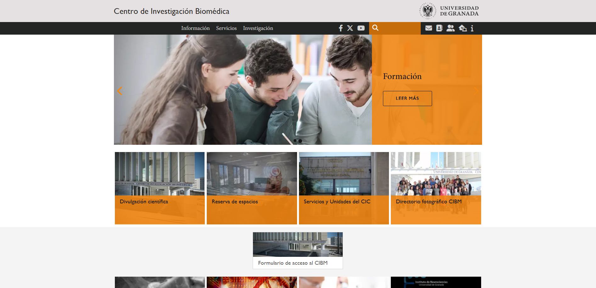
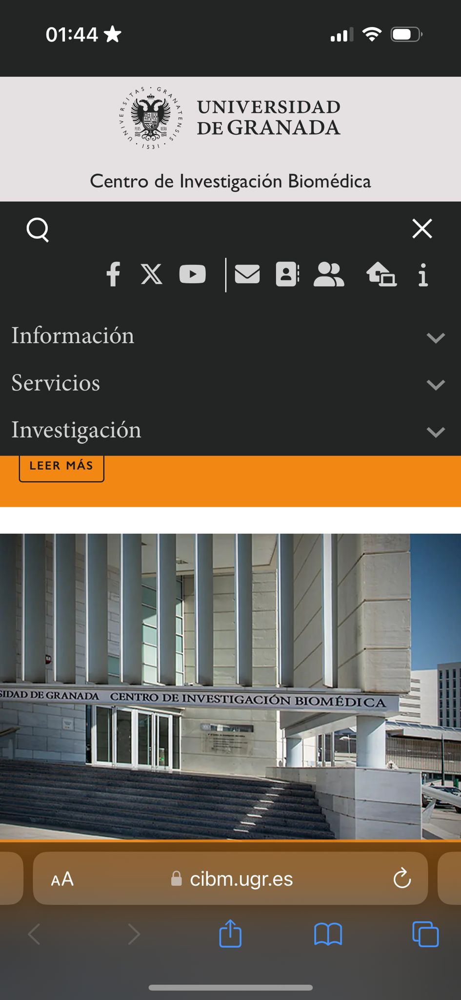

Trabajo Final para la asignatura de Diseño de Interfaces de Usuario UGR
>Carmen Chunyin Fernández Núñez  :octocat:  www.github.com/carmenxufdz

>Curso 2023/24

# Parte I: Mi Experiencia UX
## Introducción
Siempre he estado especialmente interesada en el ámbito del diseño, y era bastante consciente de la importancia de la Interacción de Usuario, de la Experiencia de Usuario y de la Usabilidad. Pero es verdad que nunca había adquirido las herramientas para poder aplicar la teoría que ya conocía a la práctica.

A veces cuando voy andando por la calle y veo los distintos diseños de las marcas, tengo pensamientos del estilo “Pues este logo no se entiende muy bien”, “Por qué habrán decidido usar este color”, “Esto está muy bien diseñado”… Aunque la mayor parte de mis pensamientos se basaban a si lo que veía era agradable a la vista y no desde un punto más técnico.

Este curso me ha ayudado a apreciar los detalles de un buen de diseño, así como a realizar el análisis de la interfaz de una aplicación o web, apreciar sus puntos fuertes y señalar sus débiles. También me ha enseñado a realizar una mejora sobre esos puntos débiles de un diseño, basándome en las necesidades de los usuarios, así como en unos principios básicos de diseño.

Gracias a esta asignatura, he aprendido mucho más acerca de la Experiencia de Usuario, y lo importante que es. Cómo una página debe cumplir ciertos requisitos para ser adecuada y que prácticamente todo lo que vemos en la página o aplicación tiene un motivo para que sea de esa forma (si es que está bien hecha).

He aprendido que, en una aplicación, el código no es lo único importante, pero, al fin y al cabo, nuestras aplicaciones las van a utilizar diferentes personas, con diferentes capacidades o habilidades, y ésta debe estar adecuada para cualquier situación.
A lo largo de mi formación en esta asignatura, he tenido la oportunidad de involucrarme en diferentes ejercicios y trabajos que han enriquecido mi comprensión y habilidades en la Experiencia de Usuario (UX). Esta experiencia me ha permitido no solo consolidar conocimientos teóricos, sino también ser capaz de aplicarlos de manera práctica en proyectos.

## Aprendizaje
En las prácticas de clases, el primer ejercicio realizado, el cual corresponde a la primera práctica, fue la realización de un análisis de una página web, en mi caso [GranaVentour](https://www.granaventour.com/) una página de actividades de aventuras en Granada. Identificando problemas como la falta de feedback inmediato, pues la página carecía de un apartado de reseñas, una navegación confusa, la existencia de una barra de búsqueda que no se podía utilizar, entre otros. Además de aportar soluciones viables para mejorar significativamente la experiencia del usuario. 

Las prácticas realizadas por mi compañero y yo se pueden consultar en la siguiente página: [Word Travel - UX Case Study](https://carmenxufdz.github.io/DIU24/#/)

En esa misma práctica, realizamos una investigación de usuarios, creando personas inventadas que fuesen como una persona real. Lo cual es más complicado de lo que parece, pues había que actuar de acuerdo al perfil de esa persona, y que fuese coherente con su personalidad, gustos, etc. Esta actividad no solo me ha permitido profundizar en la comprensión de los usuarios, sino que también proporciona una base sólida para el diseño centrado en el usuario.

También aprendí que, aunque es verdad que nuestra aplicación tiene que estar adaptada a los usuarios, los usuarios no son todas las personas del mundo. Depende el propósito de tu aplicación, vas a tener un público específico, y es a ese tipo de público al que tienes que adaptar la aplicación. Hemos hecho uso de herramientas como los Journey Map para representar los pensamientos de estas personas a lo largo de la interacción con la página web

Además, en clases de teoría, aprendimos cómo las características cognitivas y físicas de los usuarios pueden afectar a la interacción con los sistemas. Realizamos un ejercicio etnográfico en que observábamos el uso de una aplicación o sistema que debería funcionar bien, pero aún así algunos usuarios tienen problemas al usarlo.

A partir de la segunda práctica, se nos propone empezar un proyecto propio desde cero, sobre una aplicación de tema a elegir, la cual más tarde tendremos que diseñar aplicando todo lo aprendido tanto en teoría como en lo que vamos a ir aprendiendo en las prácticas.
Utilizando herramientas como figma, empecé a diseñar una página web de un club de lectura. Para empezar este proyecto, primero utilizamos herramientas como los Empathy Map, Scope Canvas y SiteMap para hacer una primera aproximación a lo que sería más tarde el diseño de nuestra página además de analizar cuales podrían ser los pensamientos de los usuarios sobre nuestra web y los objetivos de esta misma. En esta práctica, utilizamos wireframes para hacer los bocetos de lo que será más tarde nuestra página web.

En la práctica 3 nos pusimos a darle forma a la página web. Para ello en teoría aprendimos sobre la Teoría del Color, Psicología del Diseño, qué es lo que necesita un buen logo. Y con todos estos conocimientos realizamos un moodboard, que es como una lluvia de ideas, en las cuales definíamos los colores utilizados en nuestra página y por qué utilizábamos estos colores, el logo, el objetivo de la página, imágenes inspiracionales…

Una vez teniendo clara la idea de nuestra “marca” y basándonos en los bocetos realizados anteriormente, diseñamos las páginas web utilizando la herramienta de Figma. Además, en clase, hemos hecho uso de las animaciones de Figma para crear una página web creativa. 
Personalmente, la parte del diseño de la página ha sido mi preferida, yo ya tenía algunas ideas acerca de la psicología del color, la teoría del color, los espacios en blanco, la regla del 60 30 10, etc. Así que poder poner en práctica esos conocimientos ha sido especialmente divertido. Sobre todo, al lograr crear páginas web adecuadas y, además, visualmente agradables.

Como última tarea en este gran proyecto llevado a cabo, una vez terminado el diseño de nuestra web/aplicación, teníamos que hacerle un estudio para comprobar que la habíamos diseñado de forma adecuada. Para ello usamos A/B testing, dónde le hacemos un UX Report a una de las prácticas de nuestros compañeros, a la vez que lo comparamos con la nuestra.

Puede que el análisis de las aplicaciones no sea de especial interés para el usuario, quien simplemente decide si le gusta o no la aplicación y si quiere seguir utilizándola, pero es de gran ayuda y guía para el diseñador y desarrollador de la aplicación. Porque gracias a este análisis es capaz de conocer en qué puede estar fallando su aplicación, el por qué no está llegando al público adecuado, si los usuarios la encuentran fácil de usar…

Entonces, para realizar este estudio hemos utilizado diferentes tipos de usuarios para comparar las dos aplicaciones y ver recomendaciones a mejoras y puntos positivos a cerca de estas. Finalizando con un documento recogiendo todas las conclusiones de haber realizado este análisis. Además, utilizamos herramientas como el Gaze Recorder, para ver si en nuestra página llamaban la atención del usuario los objetos adecuados.

Estos usuarios, realizaron el cuestionario SUS, el cual nos permite conocer si la aplicación cumple con las características esperadas como que sea intuitiva, que no haga falta conocimientos previos para poder utilizarla o no se necesite la ayuda de un profesional, que los elementos de la aplicación sean coherentes entre sí, que sean capaz de utilizarlo diferentes tipos de perfiles de diferentes edades…

También, tras leer el UX Report realizado por nuestros compañeros sobre nuestra práctica, aprendimos qué debíamos mejorar y pudimos comprobar todo lo que habíamos aprendido a lo largo del curso. Dando un resultado, no perfecto, pero bastante satisfactorio teniendo en cuenta que era nuestra primera vez realizando un proyecto de este estilo.

Además, en teoría fuimos capaces de simular distintas discapacidades que sufren las personas, utilizando extensiones del navegador, y cómo estas afectan a la hora de utilizar las diferentes páginas web y aplicaciones. La importancia de que estas páginas y aplicaciones estén adaptadas para las personas con discapacidades. Yo siempre he tenido en mente las distintas discapacidades, pero nunca me había parado a pensar en cómo estas podían afectarles a la hora de utilizar aplicaciones.

Por último, hemos aprendido acera de como influyen las tendencias de diseño a cómo se aprecian los productos de diferentes marcas. La clara diferencia entre la propia imagen de marca hace varios años y actualmente, dejando ver lo importante que son las tendencias y el impacto que estas tienen.

## Conclusion
Tras el trascurso de este cuatrimestre, he sido capaz de desarrollar una sólida base para identificar problemas de usabilidad a través de métodos como evaluaciones heurísticas y pruebas de usuario. También he aprendido a realizar investigaciones de usuarios cualitativas y cuantitativas, lo cual ha sido clave a la hora de entender las necesidades y comportamientos de las personas. He podido poner en práctica diferentes conceptos de diseño, haciendo uso de conocimientos acerca de usuario, los colores, la importancia de lo que deseamos transmitir… 

En resumen, considero que he adquirido un alto grado de experiencia en User Experience, respaldado por una sólida base teórica y una amplia experiencia práctica. El poder aplicar estos conocimientos en diversos contextos permitirán el desarrollo de soluciones efectivas y de alta calidad que mejorarán la experiencia del usuario.

## Opinión Personal
He disfrutado bastante de todo lo aprendido en la asignatura, pienso que la mente humana es muy compleja y el tener que estudiarla para poder diseñar aplicaciones que puedan ser utilizadas por todo el mundo es muy interesante. Pienso que lo aprendido es muy importante y es aplicable en diferentes ámbitos de mi carrera profesional.  Me han gustado mucho las clases y el poder aprender más acerca de temas que ya de por sí me llamaban la atención.

# Parte II:  Caso de estudio: Evaluación de Página Web de Investigación
## Introdución
En este trabajo se realiza un análisis de usabilidad y experiencia de usuario de los sitios web de dos centros de investigación biomédica: el [Centro de Investigación Biomédica](https://cibm.ugr.es/) de la Universidad de Granada (CIBM) y el [Instituto de Biomedicina](https://www.ibis-sevilla.es/es/) de Sevilla (IBiS). El objetivo es evaluar estos sitios en términos de diseño, usabilidad, adaptación a diferentes dispositivos y experiencia de usuario, así como comparar ambos sitios para identificar fortalezas y áreas de mejora.

## Paso 1: Persona & Journey Map
En primer lugar, para conocer las necesidades de los usuarios, podemos crear una Persona de forma breve (no se hará uso de la plantilla usada en prácticas). Utilizaremos una metodología basada en heurísticas de usabilidad y se elaborará un Journey Map para entender mejor la interacción de un usuario típico con estos sitios

### Persona
> Nombre: Laura Del Rio
> 
> Edad: 30
> 
> Profesión: Investigadora Biomédica
> 
> Educación: Doctorado en Biomedicina
> 
> Ubicación: Granada, España
> 
> Manejo Tecnológico: Alto
> 
> Acerca de: Estudió en la Universidad de Granada el grado de Biomedicina y al terminar realizó un doctorado para poder dedicarse a la investigación. Actualmente trabaja investigando y aportando sus descumbrimientos a la red de científicos.
> 
> Objetivos: 
>> Encontrar información sobre proyectos de investigación actuales.
>> 
>> Conocer las oportunidades de colaboración.
>> 
>> Acceder a publicaciones científicas y recursos académicos.
>> 
>> Contactar con otros investigadores y centros.

### Journey Map
<h4>Etapa 1: Búsqueda Inicial</h4>

> Acción: Laura busca en Google "Centro de Investigación Biomédica UGR"
> 
> Motivación: Quiere encontrar información sobre las investigaciones en curso en el CIBM.
> 
> Touchpoints: Google Search, resultados de búsqueda.
> 
> Experiencia: Encuentra el sitio web fácilmente y hace clic en el enlace.

<h4>Etapa 2: Exploración de la página principal</h4>

> Acción: Laura explora la página principal para obtener una visión general del CIBM.
> 
> Motivación: Quiere obtener una visión general del CIBM.
> 
> Touchpoints: Página principal, menú de navegación.
> 
> Experiencia: Laura encuentra la información general y una introducción al centro, pero le cuesta encontrar secciones específicas como "Líneas de Investigación".

<h4>Etapa 3: Investigación de Líneas de Investigación</h4>

> Acción: Laura intenta encontrar la sección de "Líneas de Investigación".
>
> Motivación: Quiere conocer las áreas de investigación del CIBM.
>
> Touchpoints: Menú de navegación, página de investigación.
>
> Experiencia: Laura encuentra una sección de "Investigación" que incluye áreas de investigación, pero la información es bastante general.

<h4>Etapa 4: Exploración de Publicaciones y Noticias</h4>

> Acción: Laura busca información sobre publicaciones y noticias recientes.
>
> Motivación: Necesita acceder a recursos académicos y mantenerse actualizada con las novedades del centro.
>
> Touchpoints: Sección de "Publicaciones", sección de "Noticias".
>
> Experiencia: La sección de publicaciones está organizada, pero algunas publicaciones no tienen enlaces directos. La sección de noticias está bien mantenida y actualizada.

<h4>Etapa 5: Evaluación de la Estructura y Personal</h4>

> Acción: Laura navega a la sección de "Estructura" para conocer el personal del CIBM.
>
> Motivación: Quiere identificar posibles colaboradores.
>
> Touchpoints: Sección de "Estructura", perfiles de personal.
>
> Experiencia: La información sobre el personal es completa y detallada, pero algunos perfiles carecen de datos de contacto directos.

<h4>Etapa 6: Contacto con el Centro</h4>

> Acción: Laura busca cómo contactar con el centro.
>
> Motivación: Quiere iniciar una conversación con los investigadores del CIBM.
>
> Touchpoints: Página de "Contacto", formulario de contacto.
>
> Experiencia: El formulario de contacto es sencillo y funcional, pero no hay información sobre el tiempo de respuesta esperado.

| Etapa                     | Emociones     | Satisfacción | Puntos de Dolor                           |
----------------------------|---------------|--------------|-------------------------------------------|
| Búsqueda Inicial          | Expectativa   | Alta         | Ninguna                                   |
| Exploración de la Página Principal | Curiosidad | Media-Alta  | Navegación poco intuitiva               |
| Investigación de Líneas de Investigación | Interés  | Media  | Información general, falta de detalle |
| Exploración de Publicaciones y Noticias | Curiosidad | Media-Alta  | Enlaces faltantes en publicaciones   |
| Evaluación de la Estructura y Personal | Esperanza | Media-Alta | Falta de información de contacto    |
| Contacto con el Centro    | Satisfacción  | Media        | Falta de información sobre tiempos de respuesta |

<h4>Resumen de Mejoras Propuestas</h4>
<ul>
  <li>Mejora de Navegación: Hacer el menú de navegación más intuitivo y fácil de usar.</li>
  <li>Detalles en Líneas de Investigación: Proporcionar más detalles y ejemplos específicos de proyectos dentro de las áreas de investigación.</li>
  <li>Enlaces en Publicaciones: Asegurar que todas las publicaciones tengan enlaces directos a los textos completos.</li>
  <li>Información de Contacto del Personal: Incluir datos de contacto directos (correo electrónico, teléfono) en los perfiles del personal.</li>
  <li>Información sobre Tiempos de Respuesta: Informar a los usuarios sobre el tiempo esperado para recibir una respuesta tras enviar un formulario de contacto</li>
</ul>

## Paso 2: Análisis de la Página del CIBM (UGR)
En esta sección, se profundizará en el análisis de la página del Centro de Investigación Biomédica (CIBM) de la Universidad de Granada (UGR), proporcionado detalles adicionales sobre diversos aspectos del diseño, la usabilidad y la experiencia del usuario.

### Análisis del Diseño
<h4>Estética y Apariencia</h4>
La página web del CIBM de la UGR presenta una estética limpia y profesional, adecuada para un centro de investigación de alto nivel. La paleta de colores utilizada es sobria, su color principal es el naranja, el cual se asocia con la creatividad y el entusiasmo además de asociarse con la capacidad de estimular la actividad mental. Sin embargo, una mayor variedad en la paleta de colores podría mejorar la visibilidad de elementos importantes, como botones de acción y enlaces, haciéndolos más destacados y atractivos visualmente.

La tipografía es legible y coherente con la imagen institucional, pero podría beneficiarse de una tipografía más distintiva para títulos y encabezados, lo cual añadiría un toque de modernidad y ayudaría a guiar mejor la atención del usuario. En general, el diseño minimalista que presenta la página web es efectivo y evita la sobrecarga de información, aunque algunas páginas internas podrían mejorarse con una organización visual más clara y jerárquica.

<h4>Navegación y Estructura</h4>
La estructura del sitio web es clara y bien organizada, con un menú de navegación intuitivo que proporciona acceso rápido a las principales secciones del centro. No obstante, algunas secciones de gran importancia, como las líneas de investigación destacadas, podrían mostrarse directamente en la página principal para facilitar su acceso sin necesidad de navegar por el menú.

La consistencia en el diseño a lo largo del sitio web, utilizando la misma estructura y estilo que otras páginas relacionadas con la UGR, aporta una sensación de unidad institucional. Sin embargo, se observan variaciones en el diseño y la estrcutura de algunas páginas internas que podrían beneficiarse de una mayor uniformidad para mantener una experencia de usuario coherente.

### Usabilidad
<h4>Accesibilidad</h4>
Aunque el sitio web está adaptado para dispositivos móviles y computadoras de escritorio, carece de características de accesibilidad fundamentales. La inclusión de texto alternativo para imágenes, opciones de contraste alto y la posibilidad de ajustar el tamaño del texto son esenciales para garantizar que el sitio sea accesible para usuarios con discapacidades visuales u otras necesidades específicas.

La navegación es clara y en todo momento se muestra la ubicación del usuario dentro del sitio web, lo cual es positivo. Sin embargo, se podría mejorar con indicadores visuales más prominentes que resalten la sección activa del menú. Las etiquetas de navegación son claras y descriptivas, pero algunos enlaces internos podrían beneficiarse de descripciones adicionales para proporcionar más contexto.

Dado que el público esperado del sitio incluye a personas del campo biomédico, la terminología utilizada es familiar para estos usuarios. Sin embargo, sería beneficioso incluir un glosario para aquellos usuarios que no estén familiarizados con términos técnicos específicos. Además, la inclusión de una sección de ayuda o preguntas frecuentes visible en todas las páginas sería útil para mejorar la experiencia del usuario.

<h4>Interactividad</h4>
La página ofrece contenido interactivo, especialmente en la página principal con secciones de noticias y eventos que se actualizan regularmente. Esto proporciona una experiencia dinámica y mantiene a los usuarios informados sobre las actividades y avances del centro. Sin embargo, se podría mejorar la interactividad del sitio mediante la inclusión de elementos multimedia, como videos explicativos, infografías y gráficos interactivos, que podrían hacer que la información sea más atractiva y fácil de entender.

### Adaptación a Diferentes Dispositivos

La página web del CIBM se adapta bien a diferentes dispositivos, incluyendo computadoras de escritorio, tabletas y teléfonos móviles. El diseño responsive asegura que el contenido se reorganiza adecuadamente para diferentes tamaños de pantalla, manteniendo la legibilidad y la usabilidad. Sin embargo, en dispositivos móviles, algunos elementos de navegación podrían ser más accesibles, como los menús desplegables que a veces requieren varios toques para abrirse completamente.

La velocidad de carga del sitio es adecuada tanto en dispositivos móviles como en de escritorio, aunque siempre hay espacio para optimizaciones que mejoren la experiencia del usuario en términos de tiempos de respuesta y rendimiento.

### Experiencia de Usuario
<h4>Contenido</h4>
El contenido del sitio web es informativo y está bien estructurado, proporcionando información detallada sobre el centro, sus actividades de investigación, programas de docencia y noticias relevantes. Sin embargo, la descripción de las líneas de investigación y proyectos específicos podría ser más profunda para ofrecer a los usuarios una comprensión más completa de las actividades del centro.

El sitio es estable y no presenta errores evidentes, lo cual es crucial para la confianza y satisfacción del usuario. Los formularios disponibles son claros y tienen validación básica para prevenir errores de entrada, aunque podrían beneficiarse de una validación más avanzada y de la inclusión de mensajes de ayuda contextuales para guiar mejor al usuario.

En términos de funcionalidades avanzadas, la página podría incluir atajos o herramientas para usuarios frecuentes, como la posibilidad de crear perfiles personalizados, guardar búsquedas o recibir notificaciones sobre temas específicos de interés. Además, una sección de ayuda o preguntas frecuentes sería útil para mejorar la experiencia del usuario, proporcionando respuestas rápidas a dudas comunes.

<h4>Sugerencias de Mejora</h4>
<ul>
  <li>Ampliar la Paleta de Colores: Introducir más colores para resaltar elementos importantes y mejorar la estética general.</li>
  <li>Mejorar la Tipografía: Utilizar una tipografía más distintiva para títulos y encabezados.</li>
  <li>Incorporar Características de Accesibilidad: Añadir texto alternativo para imágenes, opciones de contraste alto y ajustes de tamaño de texto.</li>
  <li>Optimizar la Navegación: Utilizar indicadores visuales más prominentes y proporcionar descripciones adicionales para enlaces.</li>
  <li>Aumentar la Interactividad: Incluir elementos multimedia y gráficos interactivos para enriquecer la experiencia del usuario.</li>
  <li>Profundizar en el Contenido: Ofrecer descripciones más detalladas de las líneas de investigación y proyectos.</li>
  <li>Funcionalidades Avanzadas: Incluir atajos y herramientas para usuarios frecuentes, así como una sección de ayuda y preguntas frecuentes.</li>
</ul>

En resumen, la página web del Centro de Investigación Biomédica de la Universidad de Granada (UGR) tiene una base sólida en cuanto a diseño y estructura, pero podría mejorar en aspectos como la estética, la accesibilidad y la interactividad para ofrecer una experiencia de usuario aún más satisfactoria y enriquecedora. Implementando estas mejoras, el sitio podría convertirse en una herramienta aún más efectiva para comunicar y promover las actividades del centro.

## Paso 3: Análisis de la Página del IBiS (Sevilla)
A continuación, se pretende profundizar en el análisis de la página del Instituto de Biomedicina de Sevilla (IBiS), proporcionando detalles adicionales sobre diversos aspectos del diseño, la usabilidad y la experiencia del usuario.

### Análisis del Diseño
<h4>Estética y Apariencia</h4>
La página del IBiS presenta un diseño moderno y profesional. Utiliza una paleta de colores sobria y coherente, y consta con un buen equilibrio entre texto e imágenes, lo que facilita la lectura y navegación. Sin embargo, podría beneficiarse de una mayor variedad de colores y tipografías para mejorar la atracción visual. 

<h4>Navegación y Estructura</h4>
La navegación es intuitiva, la estructura es clara y permite un acceso rápido a la información, aunque algunas secciones podrían destacarse más en la página principal y facilitar su acceso. La página proporciona una buena visibilidad del estado actual, el menú de navegación es accesible y resalta la sección activa.

### Usabilidad
<h4>Accesibilidad</h4>
Si bien el sitio web está adaptado para dispositivos móviles y computadoreas de escritorio, falta la inclusión de características de accesibilidad importantes, como texto alternativo para imágenes y opciones de contraste alto. Estas características son fundamentales para garantizar accesibilidad para usuarios con discapacidades visuales u otras necesidades. 

<h4>Interactividad</h4>
La página ofrece contenido interactivo, como noticias y eventos que se actualizan regularmente, y ofrece accesos a publicaciones científicas. El uso de más elementos multimedia podría mejorar la interactividad y atractivo del sitio.

### Experiencia de Usuario
<h4>Contenido</h4>
El contenido es completo y bien organizado, porporcionando información detallada sobre el instituto, sus proyectos de investigación, servicios científicos y programas de docencia. La sección de investigación ofrece una buena visión de las áreas de investigación y proyectos, aunque podría profundizar en detalles más específicos. Se utiliza un lenguaje claro y comprensible para el usuario objetivo.

El sitio es estable y no se detectaron errores significativos, los formularios tienen validación adecuada para prevenir errores de entrada. Ofrece funcionalidades interactivas y enlaces a redes sociales, lo cual mejora la eficiencia de uso.

En resumen, la página del Instituto de Biomedicina de Sevilla (IBiS) tiene un diseño y estructura bien pensados que facilitan la navegación y la búsqueda de información. No obstante, la adición de características de accesibilidad y elementos multimedia interactivos mejoraría la experiencia del usuario y haría el sitio más inclusivo y atractivo.

## Paso 4: Comparativa entre ambas páginas

El diseño de CIBM es limpio y minimalista, mientras que el de IBiS es más moderno y utiliza más recursos multimedia. CIBM tiene una navegación intuitiva pero consta de menos elementos interactivos que IBiS, además IBiS contiene enlaces a redes sociales. La adaptación a diferentes dispositivos por ambas partes es adecuada, aunque la de IBiS tiene un diseño responsive más efectivo y llamativo. Ambas páginas proporcionan información clara y detallada, aunque IBiS ofrece enlaces adicionales a publicaciones relacionadas. El formulario de contacto de IBiS es más visible y accesible, además cuenta con una respuesta más personalizada. La página de IBiS tiene mejor experiencia de usuario gracias a la modernidad del diseño y mayor interactividad.

## Conclusiones y autoevaluación

En este análisis, se observa que ambos sitios web cumplen con muchos de los principios de diseño centrados en el usuario y de usabilidad. Sin embargo, ambos contienen áreas mejorables.

### Reflexión Personal

Durante las prácticas de la asignatura, he aprendido la importancia fundamental de la usabilidad y la experiencia de usuario en el diseño web. Aplicar las técnicas aprendidas me ha permitido entender cómo interactúan los usuarios con una página web y cómo optimizar estos puntos de inteacción para mejorar su experiencia general.

En resumen, lo aprendido en esta asignatura me ha proporcionado una sólida base en técnicas y metodologías de diseño centrado en el usuario. He aprendido a identificar y solucionar problemas de usabilidad y a diseñar con un enfoque claro en la experiencia del usaurio.
